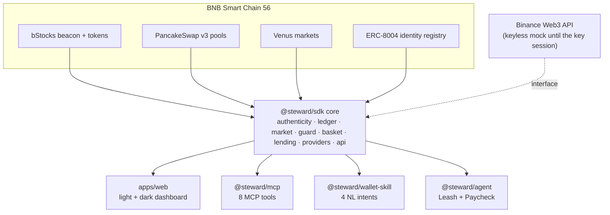

<div align="center">

# Steward

### Own a tokenized stock on BNB Chain. Do not just buy one.

Every other tool helps you **buy** a tokenized stock. Steward is the whole life of the holding after that:
know what you truly own, grow it on your convictions, use it safely and compare it across issuers.
Own-side, not buy-side. Spot only, on real BNB Smart Chain reads.

[](./LICENSE)
[](https://bscscan.com)
[](https://bnb-tokenized-stocks.vercel.app)
[](#tests-and-verification)
[](#what-is-live-vs-gated)

**[Open the live dashboard →](https://bnb-tokenized-stocks.vercel.app)**

</div>

---

Steward centers **bStocks**, the Binance-family tokenized equities that trade on real PancakeSwap depth on
BSC and reads Ondo and xStocks alongside them. The core is a live BNB Smart Chain read or a computation over
one, so it runs with no API key and no gas. It is built for the BNB Hack: Tokenized Stocks Edition.

## Contents

- [Why Steward](#why-steward)
- [Live demo](#live-demo)
- [The four pillars](#the-four-pillars)
- [The suite](#the-suite)
- [Architecture](#architecture)
- [Quickstart](#quickstart)
- [Use the SDK](#use-the-sdk)
- [Use the MCP server](#use-the-mcp-server)
- [Run the Agent Studio agent](#run-the-agent-studio-agent)
- [Verified on-chain facts](#verified-on-chain-facts)
- [What is live vs gated](#what-is-live-vs-gated)
- [Tests and verification](#tests-and-verification)
- [Tech stack](#tech-stack)
- [Licence](#licence)
- [AI assistance](#ai-assistance)

## Why Steward

Tokenized equities landed on-chain faster than the tooling did. The whole visible field is buy-side: swap
interfaces, routers, price tickers. Nobody handles what happens after you hold one. That is where the
real hazards live.

- **The market closes, the token does not.** A bStock trades through the weekend against a reference price
  that has not updated since Friday's close. The gap is visible and mostly unhandled.
- **A balance moves with no transfer.** bStocks rebase on dividends and splits, so a holder's balance changes
  under them and they cannot tell a payout from a hack.
- **The ticker lies.** The "bStocks" symbol is heavily scam-squatted on BSC. Symbol matching is unsafe in
  both directions, a real token can even carry a wrong-looking name.

Steward is the layer that makes owning legible and safe: it resolves authenticity by beacon, reconstructs the
true position through the rebases, guards a trade before it happens and reads the same equity across every
issuer honestly.

## Live demo

**https://bnb-tokenized-stocks.vercel.app**

Open it, then:

1. Toggle **light and dark** from the header. Both are first-class, the theme persists.
2. Paste any BSC address into **Know** to see holdings labelled genuine or scam by beacon, plus the
   True-Position Ledger reconstructed from Transfer history.
3. Run **Use → Guard** on a ticker and a size to get an allow, warn, resize or block verdict with plain
   reasons and **Swipe** to size a safe Venus borrow against a bStock.
4. Open **Compare** to see bStocks vs Ondo vs xStocks for one underlying, with the honest note that a DEX arb
   across them is not executable on today's liquidity.

Every panel reads BNB Smart Chain live and shows the exact block, linked to BscScan.

## The four pillars

- **Know**: see the truth. Resolve every token by its bStocks beacon, never by symbol, so a scam clone is
  caught before it costs anything. Reconstruct true cost basis, realized and unrealized position and dividend
  income from Transfer history. Detect the silent rebase that moves a balance on a dividend or split, the
  "your balance changed and you were not hacked" moment.
- **Grow**: own convictions. Thematic baskets ("AI chips", "Mag 7") expressed as a rule over genuine bStocks,
  with drift detection and a plan-only rebalance. Execution is a separate guarded step.
- **Use**: live off it, safely. A pre-trade guard folds authenticity, premium-to-NAV, pool depth and slippage
  and US market hours into one verdict. Swipe borrows USDT against a bStocks position on Venus without
  selling it, spot collateral, not a perp.
- **Compare**: the same underlying across bStocks (deep), Ondo (thin) and xStocks (dust), read only, honest
  that a cross-provider DEX arb is not executable on today's BSC liquidity.

## The suite

| Package | Name | What it is |
| --- | --- | --- |
| `packages/sdk` | `@steward/sdk` | The typed core. On-chain reader (authenticity, ledger, market, Venus lending, cross-provider), guard and basket math and a `Web3ApiClient` interface with a keyless mock adapter. Everything else imports this. |
| `packages/mcp` | `@steward/mcp` | A stdio MCP server exposing eight read-only tools (authenticity, ledger, guard, market quote, cross-provider, baskets, swipe) to any MCP client such as Cursor or Claude Code. |
| `apps/web` | `@steward/web` | The Next.js 16 dashboard. Light and dark, four pillars over live BSC reads, deployed live. |
| `packages/wallet-skill` | `@steward/wallet-skill` | A Binance Web3 Wallet skill that routes four natural-language intents to the SDK and returns a verdict plus safe parameters. Advisory, never signs. Targets the Best Use of Agentic Wallet / Wallet Skills prize. |
| `packages/agent` | `@steward/agent` | The Agent Studio agent (Leash and Paycheck): ERC-8004 identity, an ERC-8183 job model and b402 self-funding, building unsigned transactions only. Targets the Best Use of BNB Agent Studio prize. |

## Architecture

One SDK core carries every on-chain read and computation. The dashboard, the MCP server, the Wallet Skill
and the agent are thin surfaces over it, so a fix in the core lands everywhere at once.



The reference price and corporate-action feed sit behind a `Web3ApiClient` interface with a mock adapter, so
the whole suite runs, tests and demos with no API key. The real client activates when the key is wired.

## Quickstart

Requires Node 22+. It is an npm-workspace monorepo, one install covers every package.

```bash
npm install          # install the workspace (packages/* and apps/*)
npm run build        # build every package with tsc, plus the Next.js app
npm test             # unit tests (node:test, no extra runner), 37 deterministic cases
npm run smoke        # live BSC mainnet smoke: 7 genuine bStocks resolve, the scam clone is rejected
```

Run the dashboard locally:

```bash
npm run dev -w @steward/web      # http://localhost:3000
```

## Use the SDK

The core resolves a token by its beacon, never by symbol and never caches a balance (bStocks rebase). All
reads are keyless.

```ts
import { makeClient, isGenuineBStock, guard, market, api } from "@steward/sdk"

const client = makeClient() // BSC mainnet, public RPC

// Authenticity: is this the real NVDAB or a scam clone?
const genuine = await isGenuineBStock(client, "0x02Fca66C1D1aFB4E2A7884261eB00F63598a7436")

// A live quote: spot price, pool depth and slippage for a 1000 USDT buy.
const quote = await market.quoteUsdtBuy("0x02Fca66C1D1aFB4E2A7884261eB00F63598a7436", 1000)

// A full pre-trade verdict (reference price via the keyless mock until the API key is wired).
const verdict = await guard.guardTrade({
  token: "0x02Fca66C1D1aFB4E2A7884261eB00F63598a7436",
  usdtIn: 1000,
  api: new api.MockWeb3ApiClient(),
})
console.log(verdict.action, verdict.reasons) // "allow" | "warn" | "resize" | "block"
```

## Use the MCP server

After `npm run build`, the server runs over stdio and exposes eight read-only tools:
`is_genuine_bstock`, `position_ledger`, `pre_trade_guard`, `market_quote`, `compare_providers`,
`list_baskets`, `analyze_basket`, `swipe_quote`.

```bash
node packages/mcp/dist/cli.js        # or: npm start -w @steward/mcp   (bin: steward-mcp)
```

Add it to an MCP client (Cursor, Claude Code) so an agent can reason over tokenized stocks on BSC:

```json
{
  "mcpServers": {
    "steward": { "command": "node", "args": ["packages/mcp/dist/cli.js"] }
  }
}
```

## Run the Agent Studio agent

A dry run reads the chain and the keyless mock, prints the ERC-8004 identity, the guard-railed Leash
rebalance plan and the Paycheck b402 preview, then exits. It builds unsigned transactions only and signs or
sends nothing.

```bash
node packages/agent/dist/run.js once 0xYourAddress ai-chips
```

Leash keeps the agent on a leash: a ticker allowlist, a per-position cap and a daily budget, with every buy
leg run through the guard. Paycheck models routing dividend income through b402 (x402 v2 on BSC) over an
EIP-3009 stablecoin. On-chain writes are surfaced as ready commands, never executed for you.

## Verified on-chain facts

Read from BNB Smart Chain (chain id 56), not copied from a blog. Re-verify before quoting them anywhere it
matters, because the governable ones move on a vote.

- **bStocks beacon** [`0x156d6DCe9A4F6139a3406F1f021F1a4880dE93A3`](https://bscscan.com/address/0x156d6DCe9A4F6139a3406F1f021F1a4880dE93A3).
  Every genuine bStocks token is a beacon proxy pointing here. Authenticity is a read of the token's EIP-1967
  beacon slot compared to this address.
- **Venus collateral markets** (genuine bStocks usable as spot collateral for a USDT borrow):
  - TSLAB vToken `0x97421799419Eb782628e73e7220d8E0A207469a3`, underlying `0x5b1910eAaD6450E50f816082Aa078C41F10C292f`
  - NVDAB vToken `0xEb8Ca841cBe1BC4832A10b15c7dAB1081eDaD371`, underlying `0x02Fca66C1D1aFB4E2A7884261eB00F63598a7436`
  - SPCXB vToken `0xC36dFaCc7a125859C106F29b9F2d874CCF29A55A`, underlying `0xbe9D156892E55e7154BcD3cB0FEA677F9D3103E1`
  - SKHYB vToken `0x3E281461efb3D53EC20DB207674373Ed8Ef3BbA9`, underlying `0xCA750eF65f295BBECd685Abf54e82CAf297BDB61`
- **ERC-8004 Identity Registry** [`0x8004A169FB4a3325136EB29fA0ceB6D2e539a432`](https://bscscan.com/address/0x8004A169FB4a3325136EB29fA0ceB6D2e539a432).
  `name()` "AgentIdentity", `symbol()` "AGENT", ERC-721. The agent's registration transaction targets it.

## What is live vs gated

Steward is honest about what a judge can run today with no key and no funds.

- **Live and free.** Every on-chain read: authenticity by beacon, the position ledger from Transfer history,
  PancakeSwap v3 price, depth and slippage, the Venus reads behind Swipe and the cross-provider comparison.
  No key, no gas. The deployed dashboard and the MCP server run on these today.
- **Client-side by design.** The True-Position Ledger reads Transfer logs in your browser, off your own IP,
  because free public BSC RPCs serve `eth_getLogs` from a residential IP but rate-limit it from a cloud IP.
  A small default scan window clears reliably. On a rejection the panel degrades to the live balance and
  authenticity with a clear note. Set `STEWARD_LOGS_RPC` to a keyed logs endpoint to remove the limit.
- **Keyless mock for now.** The Binance Web3 API (reference price for premium-to-NAV, corporate-action feed)
  sits behind a `Web3ApiClient` interface with a `MockWeb3ApiClient`. Every mock value is labelled. The real
  client activates when the API key is wired. Its endpoint and field names are marked UNVERIFIED in the
  source until a keyed session confirms them.
- **Gated on gas or a key.** Live trades and deploys need BNB and a signing key. The suite builds unsigned
  transactions and stops at the signing line, surfacing one ready command. ERC-8183 is a draft with no
  deployed contract, so the job model follows the draft shape and says so.

## Tests and verification

- **37 unit tests** (`node:test`, deterministic, no network) over the pure logic: guard verdict bands, ledger
  FIFO and corporate-action detection, basket weight and drift and rebalance, Venus health math, and
  PancakeSwap price and slippage math. Run `npm test`.
- **Live smokes** against BSC mainnet for chain, market, lending, basket, guard and providers.
- **End to end**, verified against the live deployment: the six server routes return real data, the MCP
  server answers over stdio for all eight tools, the agent dry-run completes the Leash and Paycheck loop, and
  the Wallet Skill classifies and answers an intent.

## Tech stack

TypeScript, [viem](https://viem.sh) for all chain access, Next.js 16 App Router with Tailwind 4 for the
dashboard, the [Model Context Protocol SDK](https://modelcontextprotocol.io) for the MCP server and npm
workspaces. No database, no backend beyond the app's own route handlers. Deployed on Vercel.

## Licence

The suite is source-available, no derivatives, under `LicenseRef-zkasuran-SAND-1.0` (see [`LICENSE`](./LICENSE)).
It is a competition entry, not a contribution, so redistribution and derivative works are withheld while you
may run it, read it, decompile it and benchmark it. The one exception is `@steward/wallet-skill`, which is
**MIT** so it can be adopted into the Binance skills hub. Third-party components keep their own terms, listed
in [`NOTICE`](./NOTICE). Lineage is recorded in [`PROVENANCE.json`](./PROVENANCE.json).

## AI assistance

AI (Claude, Anthropic) was used in building this suite. The design, the on-chain verification and the review
are the author's. On-chain facts were checked against BSC mainnet before they were relied on. The
Developer Experience Report submitted alongside this entry is a separate, human-written account. Nothing in
this repo signs, sends or spends.


